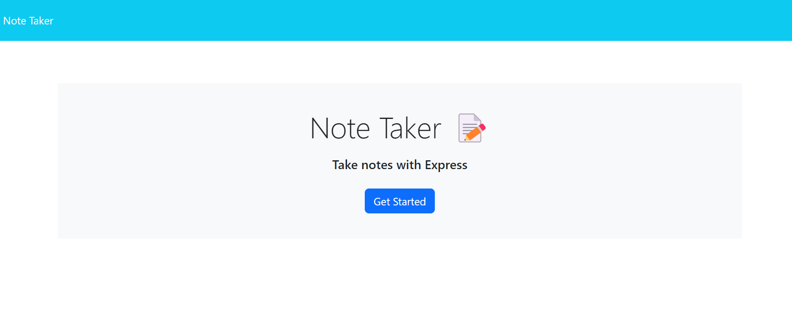

# Create-My-Own-Notes
## Description
This application helps the user take notes and store their information on the side, so when they want to go back, they can always go back and review their notes. 

[Go to Website here](https://ari07-ari.github.io/Javascript-Knowledge-Quiz/)

## Installation
The purpose of this application is to help users have an easier organized note site. The user will have to write a title and then a description. Then the save icon will appear and will then save it on the left side for future reference. To recap a note, just click on the desired note and it will appear. 

## Usage
The purpose of this application 

## Credits
The University of Toronto,
Ariana Vinamagua